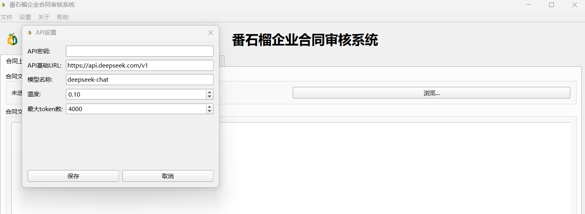
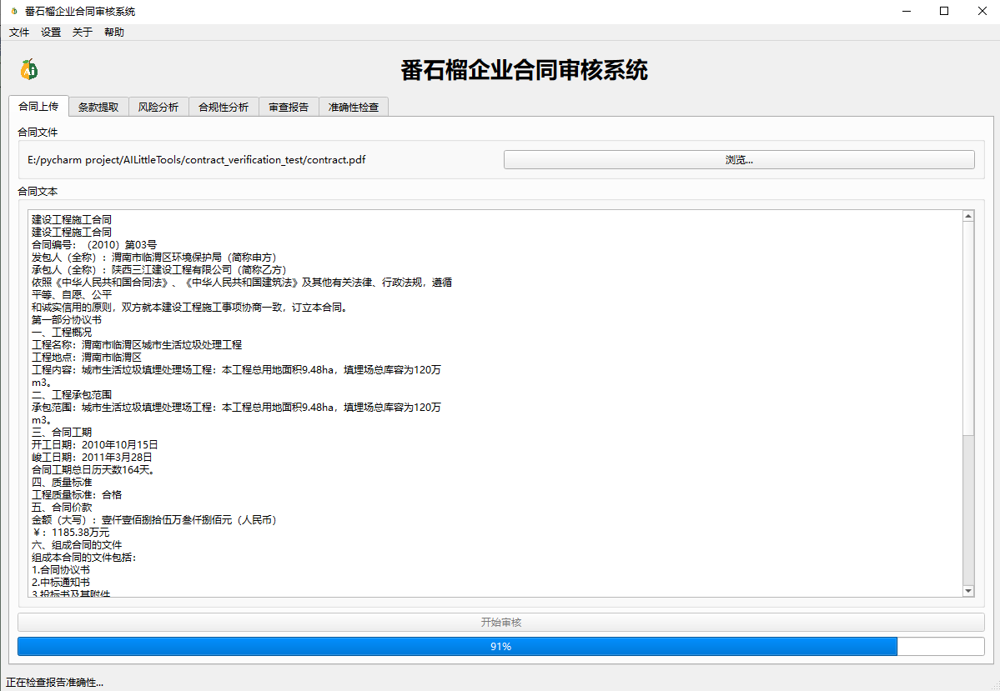
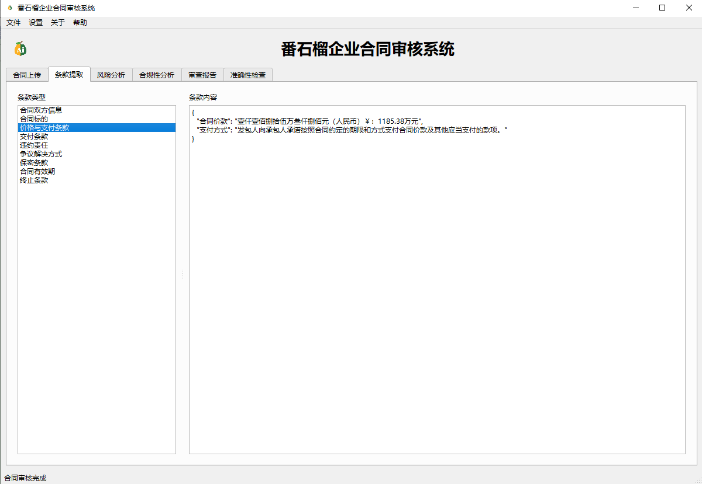
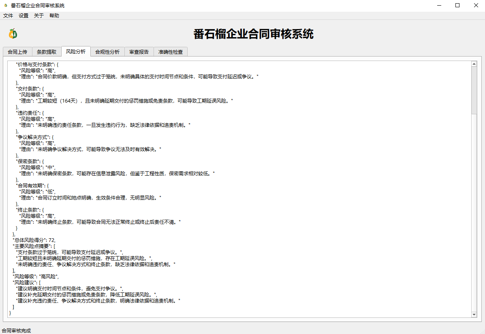
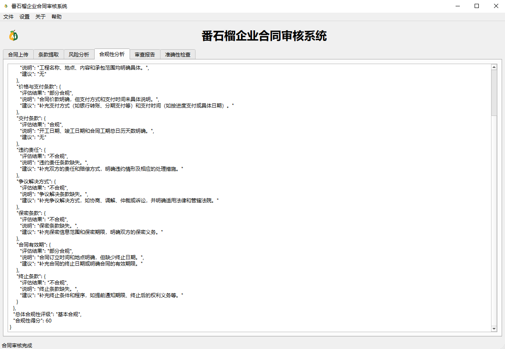
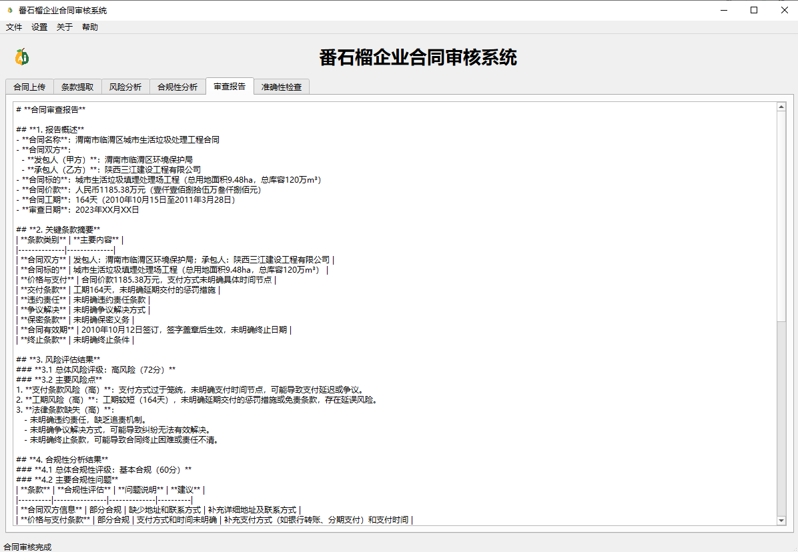
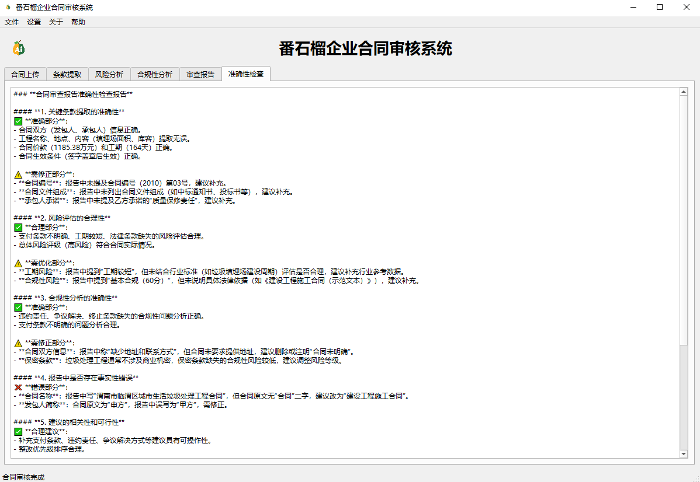
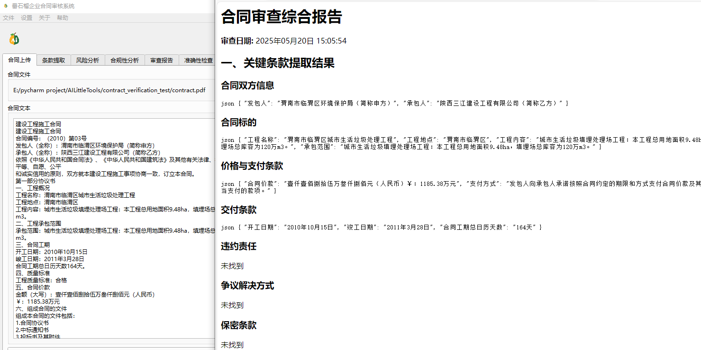

# 番石榴企业合同审核系统

## 项目概述
番石榴企业合同审核系统是一款专为企业打造的智能合同管理工具，旨在帮助企业高效、准确地处理各类合同文件。系统利用先进的LLM技术，能够自动提取合同条款、进行风险分析和合规性检查，并生成详细的审查报告。通过该系统，企业可以有效降低合同风险，提高审核效率，确保合同符合法律法规和企业内部政策要求。

## 主要功能
1. **合同条款提取**：自动从合同文档中提取关键条款和信息，如双方当事人、合同期限、付款方式、违约责任等。
2. **风险分析**：对合同条款进行风险评估，识别潜在的法律风险、财务风险和商业风险，并提供相应的风险等级和建议。
3. **合规性分析**：检查合同是否符合相关法律法规和企业内部政策要求，确保合同的合法性和合规性。
4. **审查报告**：生成详细的合同审查报告，包括条款摘要、风险分析结果、合规性检查结果等，便于审核人员和管理层查看和决策。
5. **准确性检查**：对合同中的数据和信息进行准确性检查，确保合同内容的一致性和准确性。
6. **多格式导出**：支持将分析结果保存为txt、markdown或者html格式，方便用户根据需要进行查看、编辑和分享。

## 安装与配置
### 环境要求
- Python 3.11及以上版本

### 依赖安装pip install -r requirements.txt
### 配置文件
系统需要配置大模型的相关参数，按照提示填写即可。

## 使用方法
### 你可以使用我已经打包好的【合同审核.exe】文件，直接运行，直接使用，无需安装任何依赖，从右侧【Releases】中下载
### 或者利用本项目源码启动系统python contract_tool.py
### 上传合同
系统启动后，在界面上选择要上传的合同文件，支持txt、docx以及pdf格式的合同文件。

### 执行分析
上传合同后，系统会自动进行条款提取、风险分析和合规性检查等操作。

### 查看结果
分析完成后，可以在系统界面上查看详细的审查报告等。

### 导出报告
点击导出按钮，选择需要的格式（txt、markdown或html），将分析结果保存到本地。

## 贡献指南
欢迎对番石榴企业合同审核系统的任何贡献。或者你有任何建议或想进一步交流，请提交issue或联系我。

## 许可证
本项目采用[MIT许可证](LICENSE)。

## 联系我
如果你有任何问题或建议，请联系我们：
- QQ：2229029156

    